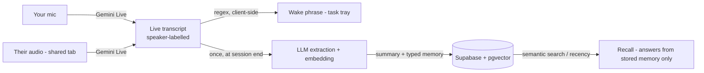

# Second Coworker

**Your AI teammate that remembers every meeting, captures tasks in real time, and recalls past context exactly when you need it.**

Meeting tools give you a transcript. Nobody reads the transcript. Second Coworker
throws the prose away and keeps the *structure* — the decisions, the commitments,
the constraints — so that three weeks later, "what did we decide about pricing?"
has an answer instead of a search result.

Working prototype. The full loop runs end to end. Built for **iQOO Hackathon 2026**.

---

## The problem

Every meeting produces decisions. Almost none of them survive.

The current answer is transcription: Fireflies, Granola, Fathom, Otter, Limitless
all record the room and hand back a wall of text with a summary stapled to the
top. That's a better filing cabinet, not a better memory. The information is
technically present and practically unreachable — you'd have to know which
meeting to open before you can find what you forgot.

So the question that actually matters is never *"what was said?"* It's
**"what did we decide, and why?"** — asked weeks later, by someone who doesn't
remember which meeting to look in.

## The bet

**Store memory objects, not transcripts.**

When a session ends, one model call extracts the transcript into a fixed set of
categories — `Task`, `Decision`, `Preference`, `Requirement`, `Fact`,
`Action Item` — and those objects are what get persisted. Recall then answers
from the structured objects, never by re-reading raw text.

|  | Transcript tools | Second Coworker |
|---|---|---|
| What's stored | Raw text + a summary | Structured memory statements |
| Retrieval | Search the meeting you already remembered | Ask a question across all meetings |
| Answer to "why did we drop X?" | A timestamp to go read | The decision, and the meeting it came from |
| Grows more useful over time | Archive grows | Memory grows |

The categories are deliberately fixed and small. An open-ended "extract what
seems important" prompt collapses back into summarization — which is the thing
that already doesn't work.

## How it works



1. **Start a session.** Speech renders live in the browser — no server round-trip.
2. **Say a wake phrase.** *"Hey Coworker, remind me to send the deck"* → the task
   appears in the tray instantly. This is a regex on the transcript stream, not a
   second model running continuously.
3. **End the session.** The transcript goes to the LLM **once** and comes back as
   strict JSON: `{summary, memory, tasks, facts}` — every item typed by one of the
   six categories, persisted as structured objects rather than flattened to text.
4. **Ask later.** *"What did I decide in yesterday's meeting?"* → the backend
   retrieves the most relevant past sessions (by semantic similarity, or recency
   as a fallback) and the model answers **only** from that retrieved context. If
   the answer isn't there, it says so instead of guessing — and shows the meetings
   it searched, each one click away.

Two design choices worth calling out, because they're the ones people ask about:

- **Extraction runs once, at the end** — not every few seconds. Continuous
  extraction burns tokens to produce worse structure, because the model can't see
  where the conversation landed until it lands.
- **Retrieval is semantic, with a recency fallback.** Each session is embedded
  (`gemini-embedding-001`, 768-dim) and recall finds the most *relevant* past
  meetings by pgvector similarity — not just the most recent. Where pgvector
  isn't set up it falls back to recency, so the app runs either way. (This was
  recency-only by design in the 2-3 day prototype; it graduated to vector search
  once the project outgrew that scope — see [docs/ROADMAP.md](docs/ROADMAP.md).)

## What's actually built

Honest status, because a demo that overclaims is worse than a small one that doesn't.

| | |
|---|---|
| Live transcription, both sides | ⚠️ Built and building clean; needs a real two-party call to confirm |
| Wake-phrase → task tray | ✅ Verified, handles phrases split across pauses |
| End-of-session extraction | ✅ Verified against live Gemini |
| Typed memory (six categories) | ✅ Extracted, stored (`memory` column) and shown in Summary, Review and the PDF |
| Supabase persistence | ✅ Verified |
| Cross-session recall | ✅ Verified, including date-relative questions; answers cite the meetings searched |
| Semantic recall (pgvector) | ✅ Built; gated behind the pgvector migration, recency fallback until then |
| Contradiction detection | ✅ On-demand; flags where a session reverses an earlier decision |
| Pre-meeting briefing | ✅ Open commitments + context before a session, no AI call |
| Per-session PDF export | ✅ Summary, memory and transcript as a styled PDF |
| Installable from the browser (PWA) | ✅ Manifest, icons and service worker in place |
| Speaker attribution (you / them) | ✅ Two separate streams, no diarization model |
| Session review screen | ✅ Master–detail, grouped by date, verified against real sessions |
| Auth / multi-user | ❌ Out of scope — single-user prototype, RLS off |

## Stack

| Layer | Choice | Why |
|---|---|---|
| Frontend | React + Vite | Five screens, state-based switching — no router needed |
| Transcription | `gemini-3.5-transcribe-live` | Realtime, free tier, and accepts a raw stream — which is what makes capturing the other participant possible |
| Backend | FastAPI | `/docs` gives a live API explorer |
| AI | `gemini-3.5-flash-lite`, `temperature: 0` | Structured output via `response_schema` enforces the JSON contract; flash-lite for its generous free-tier daily limit |
| Embeddings | `gemini-embedding-001`, 768-dim | Semantic recall; separate quota from the chat model |
| Database | Supabase + **pgvector** | Postgres without running Postgres; vector column + similarity search for recall |

The provider is chosen at runtime by which key is in `.env` (`GEMINI_API_KEY` vs
`OPENAI_API_KEY`), and the prompts live in [`prompts/`](prompts/) as files rather
than string literals — so swapping models is a one-file change and the
`{summary, memory, tasks, facts}` contract holds either way (`tasks` and `facts`
are flattened views of `memory`, kept for backward compatibility).

Temperature is pinned to `0` everywhere. A demo that answers differently on the
second run isn't a demo.

**[docs/ARCHITECTURE.md](docs/ARCHITECTURE.md)** is the system design: the two
audio paths, why audio bypasses the backend, how echo and session expiry are
handled, and the request lifecycle for every route.

```
backend/     FastAPI app, Supabase client, LLM + embedding calls, demo seeder, embed backfill
docs/        system design + roadmap
frontend/    React + Vite, five screens, PWA manifest
database/    schema.sql (base tables + optional memory / pgvector migrations)
prompts/     extraction + recall + contradiction prompts
```

---

## Quickstart

Requires **Node 18+**, **Python 3.11+**, and desktop **Chrome or Edge** —
capturing another tab's audio needs `getDisplayMedia` with audio, which Firefox
and Safari don't support.

**1. Backend**

```bash
cd backend
python -m venv venv
venv\Scripts\activate          # Windows
# source venv/bin/activate     # macOS/Linux
pip install -r requirements.txt
```

Copy `.env.example` to `.env`:

| Variable | Where to get it |
|---|---|
| `SUPABASE_URL` | Supabase → Project Settings → API → Project URL |
| `SUPABASE_KEY` | same page → `anon` `public` key |
| `GEMINI_API_KEY` | [aistudio.google.com/apikey](https://aistudio.google.com/apikey) (free tier) |

Set **only one** AI key — the backend refuses to run a call if both are present.

**2. Database**

Run [`database/schema.sql`](database/schema.sql) in the Supabase SQL editor.
It's idempotent. RLS is intentionally off: there's no auth in this prototype, and
enabling it without policies denies every insert.

The file's later blocks are **optional upgrades** — the app runs without them and
detects each at startup:

- the `memory` column turns on persisted categories in Review and the PDF;
- the **pgvector** block (extension + `embedding` column + `match_sessions`)
  turns on semantic recall. After running it, backfill existing rows:
  `cd backend && python embed_sessions.py`.

Without either, the app falls back cleanly (flat tasks/facts, recency recall).

**3. Frontend**

```bash
cd frontend && npm install
```

**4. Run** — two terminals:

```bash
cd backend && venv\Scripts\activate && uvicorn main:app --reload
cd frontend && npm run dev
```

Open **http://localhost:5175** in Chrome and accept the microphone prompt.
The backend is reached through Vite's `/api` proxy, so you don't open port 8000
directly.

**Before a demo,** seed a backdated session so "yesterday" has something real to
find — otherwise every session is timestamped today and the answer is vague:

```bash
cd backend && python seed_demo.py --reset
```

---

## Deploying

The app installs to a phone or desktop home screen as a PWA, and once deployed it
works without anything running locally.

The key idea: **the frontend always calls `/api/...` same-origin.** In development
Vite proxies that to `localhost:8000`; in production Vercel rewrites it to the
hosted backend. The frontend never learns the backend's real URL, so there is no
CORS configuration and no build-time API variable to get wrong.

**1. Backend → Render**

[`render.yaml`](render.yaml) is a blueprint: point Render at this repo and it
picks up the build and start commands. Set `SUPABASE_URL`, `SUPABASE_KEY` and
`GEMINI_API_KEY` in the dashboard — they're marked `sync: false` so they're never
read from the repo.

Note the free plan sleeps after inactivity and takes **~50s to wake**. Hit the
URL once before any demo.

**2. Frontend → Vercel**

Set the project's **Root Directory** to `frontend`. Vercel auto-detects Vite.

Then edit [`frontend/vercel.json`](frontend/vercel.json) and replace
`REPLACE-ME.onrender.com` with the Render URL from step 1. That single rewrite is
the whole integration.

**3. Install it**

Open the Vercel URL in Chrome → **⋮ → Add to Home Screen**. It should say
**Install**, not "Add shortcut" — a shortcut means the manifest wasn't accepted
and you'll get a browser tab instead of an app.

> **Deploying makes the data public.** There's no auth, and RLS is off, so anyone
> with the URL can create sessions and read every stored memory. That's fine for
> a demo with demo data. Don't put a real meeting through the hosted version.

## Gotchas worth knowing

Each of these cost us real hours.

**`uvicorn --reload` silently serves stale code.** The reloader spawns a child
worker; killing only the PID uvicorn printed leaves that worker orphaned and still
bound to the port, serving old code — and Windows keeps attributing the socket to
the dead parent, so it looks like a phantom listener. Kill by name:

```bash
taskkill /IM python3.11.exe /F   # note: python3.11.exe in this venv, not python.exe
```

**Android Chrome ignores `continuous`** and ends recognition after every
utterance. `useSpeechTranscript` restarts it on `end` with a short delay —
restarting synchronously races the teardown, throws `InvalidStateError`, and the
transcript dies after one sentence.

**The other participant needs their tab shared.** Their audio reaches you through
your speakers, not your microphone, so the app asks you to share the meeting tab
**with "Also share tab audio" ticked**. Sharing without it silently succeeds and
captures only your side — the app detects this and says so.

**Both-sides capture is desktop-only.** `getDisplayMedia` audio doesn't exist on
Android, so on a phone the app records your microphone alone.

**Speech needs a secure context.** `localhost` and `https://` work;
`http://192.168.x.x` is refused outright by the browser.

## Roadmap

The core loop plus several memory features are built (see the status table
above); [docs/ROADMAP.md](docs/ROADMAP.md) has the full plan. Still ahead, in
rough order:

- **Memory Graph** — link decisions to the requirements and people they touch
- **Task lifecycle** — done/blocked state, so "what's outstanding?" reflects reality
- **Proactive pre-meeting brief** — an LLM-synthesized version of today's
  rule-based briefing
- **Live proactive alerts** and **integrations** (Slack/Jira/calendar) — larger,
  and the first one changes the "nothing heavy runs live" rule, so both are
  deliberately later phases

## License

MIT — see [LICENSE](LICENSE).

---

<sub>[`CLAUDE.md`](CLAUDE.md) is the locked scope for this prototype and takes
precedence over this README.</sub>
